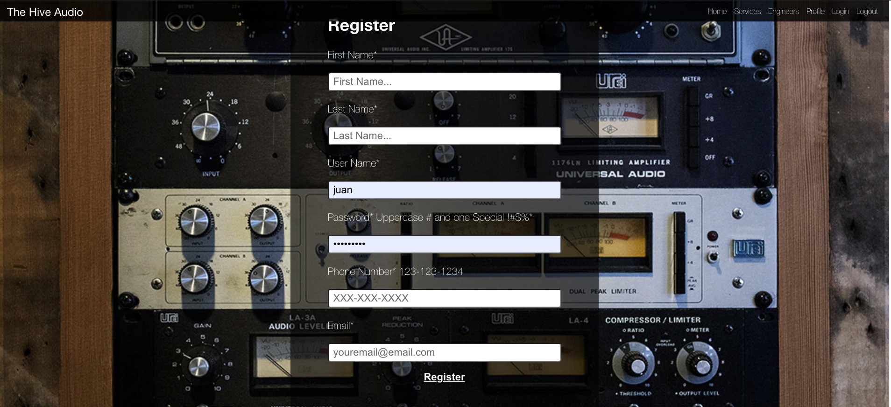
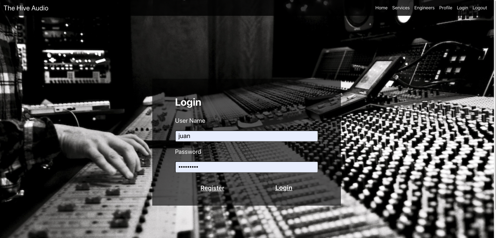
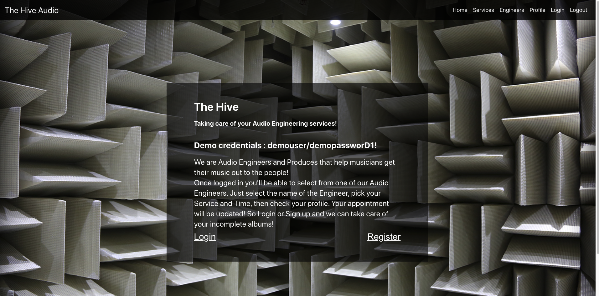
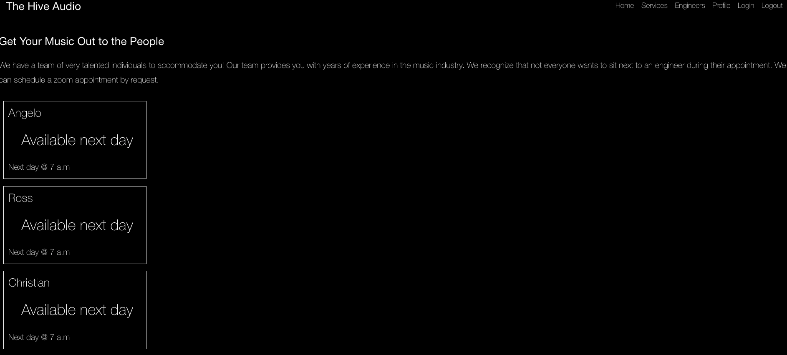
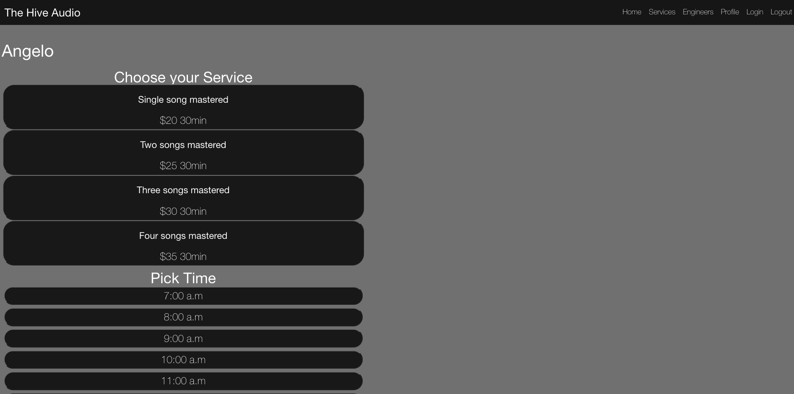
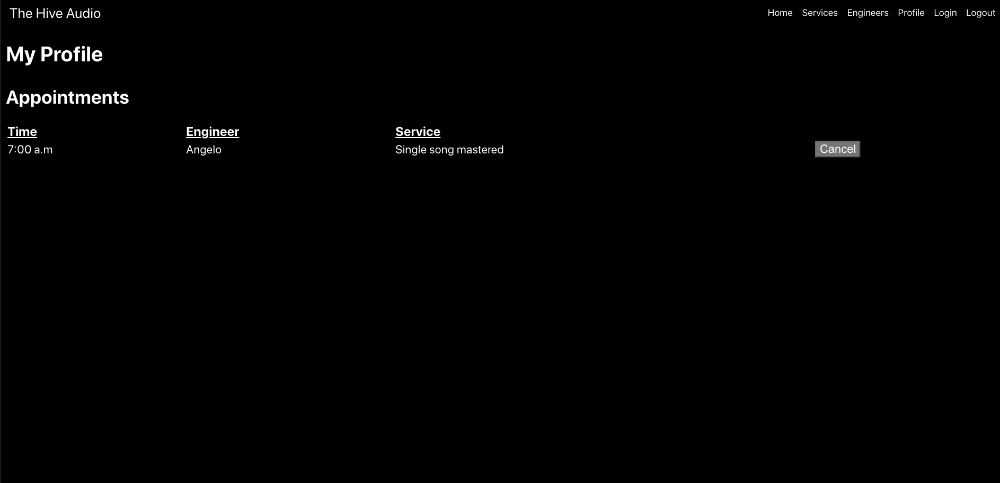

# The Hive Capstone

---------------------------------------------------------------------------------

 [Live Demo](https://the-hive-client-capstone.vercel.app)

 [Server Repo](https://github.com/AngeloThinks/the-hive-server-capstone.git)
 
 [Client Repo](https://github.com/AngeloThinks/the-hive-client-capstone.git)
 
user_name: 'user',
password: 'User1234!'

---------------------------------------------------------------------------------
## About:

The Hive is a service for musicians that are too busy to do it all. There's production, practicing, mixing, and mastering. Hive is here to help the user utilize the services of our Audio Engineers and Producers. This app will allow users to book a session with the Engineer of their choice through an appointment system.

---------------------------------------------------------------------------------

## Technologies Used

### FrontEnd

   * JavaScript
   * React
   * React-Router

### Backend

   * Postgres
   * NodeJs
   * Express
   * Knex
---------------------------------------------------------------------------------

## Routes

### '/' the Landing page route

This is the first page users will land on. Where they can see a demo of our site, sign up, and log in.

---------------------------------------------------------------------------------

### '/register' sign up page route

This is where users can sign up in order to get an authenticated JWT to access the entire website.  If they try access another route without an authenticated JWT they will be redirected back to the login page.

---------------------------------------------------------------------------------

### '/login' login page route 

This is where users can login with Username and Password to sign into the app.

---------------------------------------------------------------------------------

### '/dashboard' the dashboard route is private route for signed up users (and demo)

This is where users are directed after sign up and login. Users now have full access to finding Audio Engineers, available times, and make an appointment.

---------------------------------------------------------------------------------

### '/service' the service route is private route for signed up users (and demo)

On this page, users view the prices for song mastering for one song or multiple songs.

---------------------------------------------------------------------------------

### '/Engineers' the Engineers route is private route for signed up users (and demo)

 On this page, users view the available Engineers. 

 ---------------------------------------------------------------------------------

### '/booking' the Booking route is private route for signed up users (and demo)

 On this page, users select the amount of songs to master, and the time they need to be mastered and book their appointment.

 --------------------------------------------------------------------------------- 

### '/profile' the Profile route is private route for signed up users 

 On this page, users view their profile, which is their selected Time, Engineer, and Service.  

